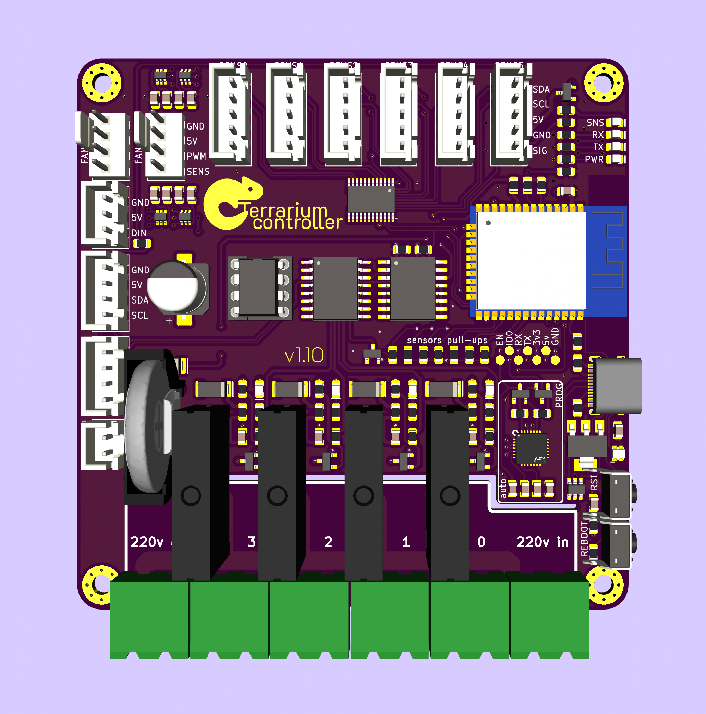
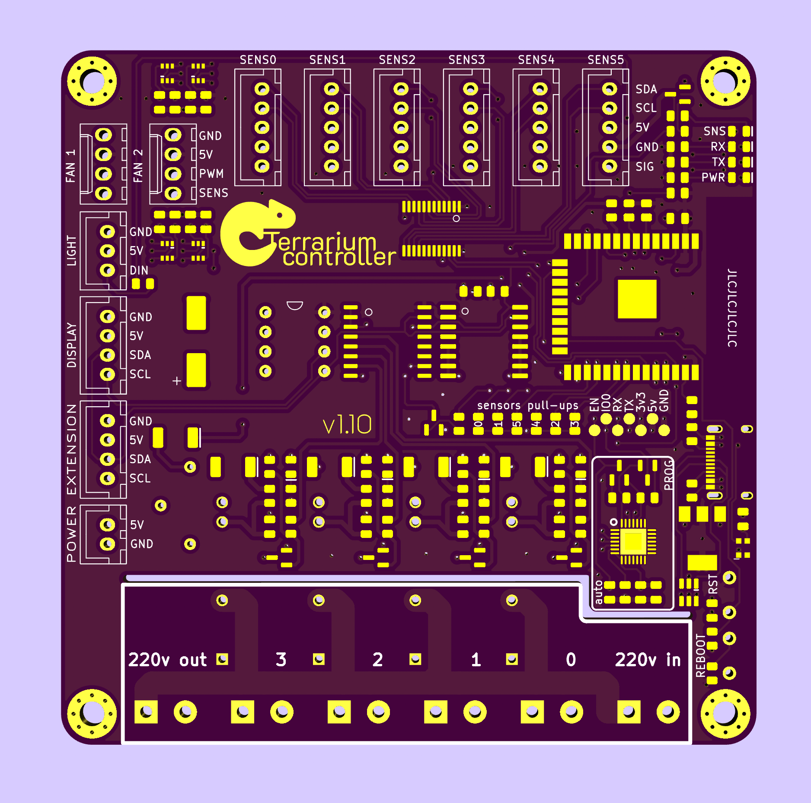
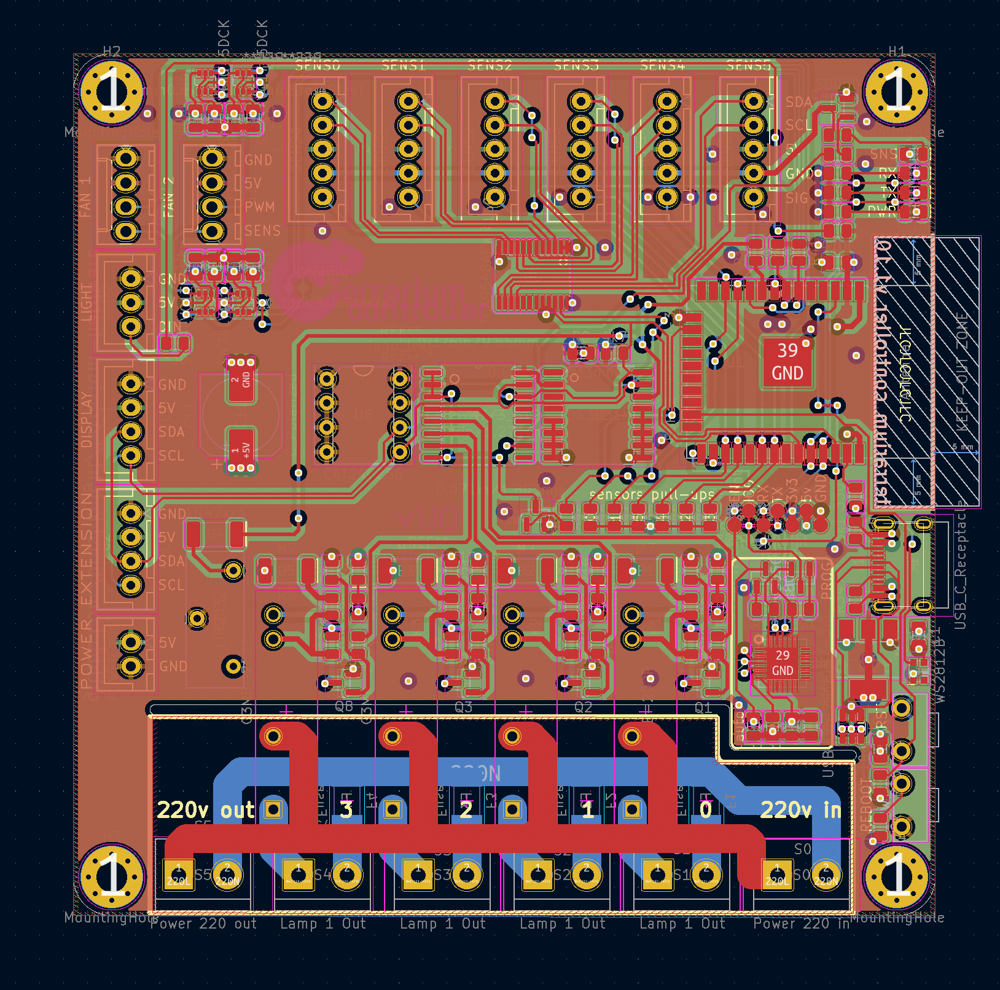

# Terrarium controller (esp32 based)
[Firmware is here](https://github.com/brushknight/terrarium-firmware)

This terrarium controller is capable of controlling set temperature, heat, and UVB lamps taking into account the time of the day.

## Features
- ESP32 WROOM 32 as a main brain of the system
- EEPROM i2c DIP-8 socket for user configuration storage
- 6 x 5v i2c & 1wire sensors
- 4 x 5v SSR to drive up to 3 x 220v2A loads
  - Protected by SMD fuse with max current limited to 1.5A/220V
- 2 x 5v 3/4pin PWM fan support
- i2c Display to show crusial information
- i2c RTC DS3231M + battery to keep time between power outages
- i2c multiplexer TCA9548APWR
- i2c IO expander PCF8574
- i2c extensions port
- cp2102 USB to UART
  - It is bidirectional now
  - Includes ESD protection
- USB-C for power and flashing
- 0805 components size

# Images

