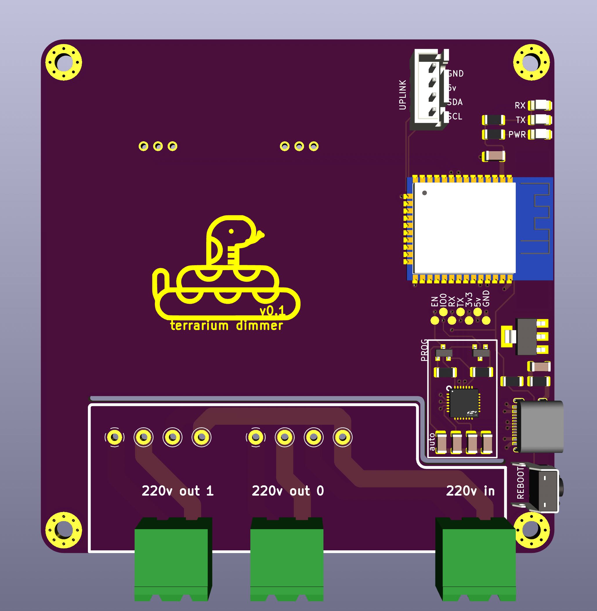
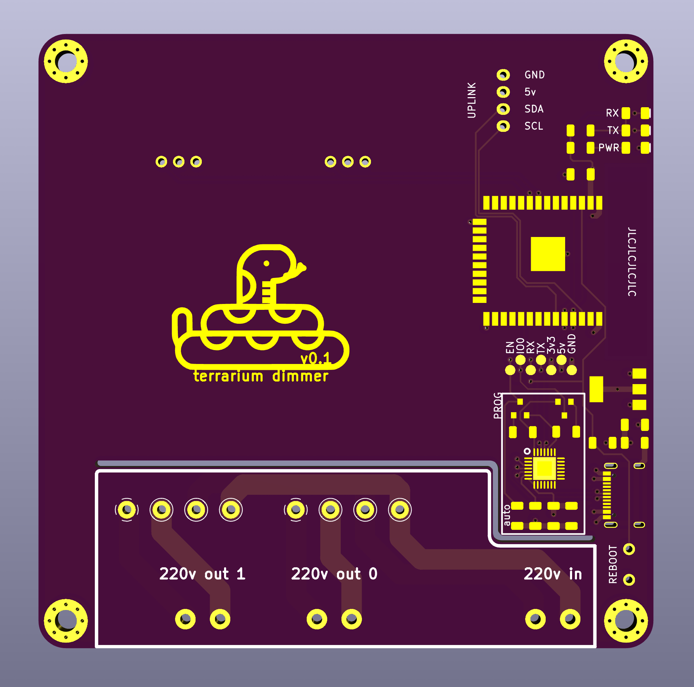
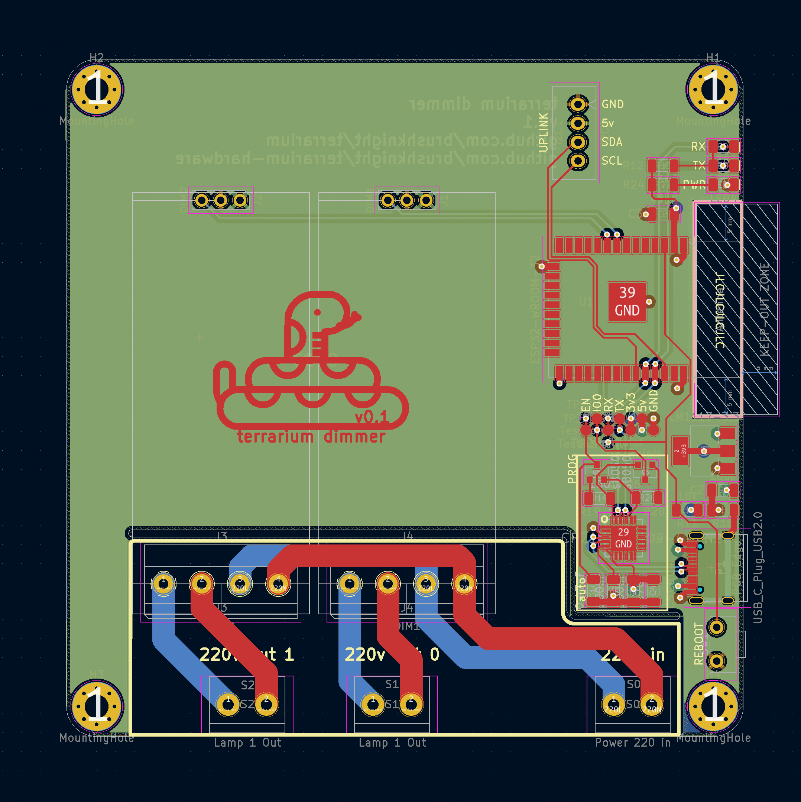

# Terrarium dimmer (esp32 based)
[Firmware will be here](https://github.com/brushknight/terrarium-firmware)

This terrarium dimmer is capable of controlling brightness of the incandescent lamps taking into account the time of the day.

## Features
- ESP32 WROOM 32 as a main brain of the system
- 2 pwm dimmer modules
- i2c extension port (used for connecting to the main controller)
- cp2102 USB to UART
- USB-C for power and flashing

# Images

